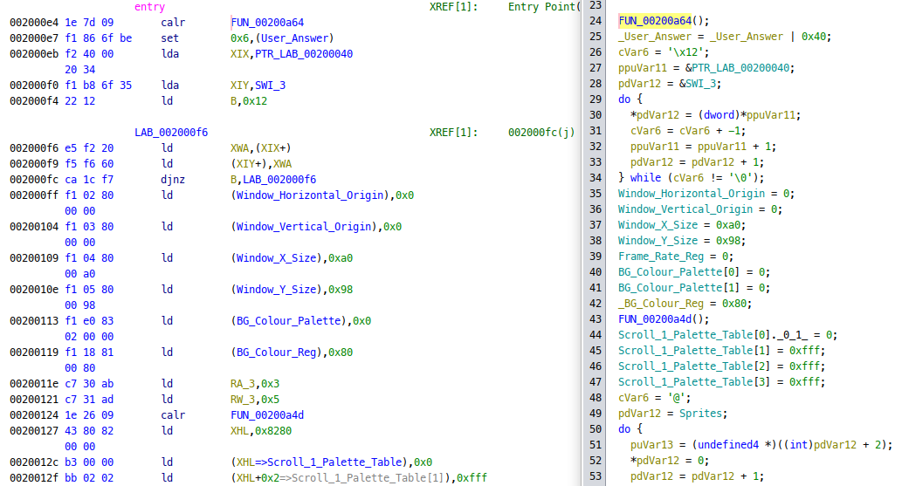

# Ghidra Neo Geo Pocket Loader

Loads game ROMs for the Neo Geo Pocket console. Adds memory map and labels for BIOS functions and I/O ports.

# Usage

```sh
GHIDRA_INSTALL_DIR=
gradle -PGHIDRA_INSTALL_DIR=$GHIDRA_INSTALL_DIR buildExtension
mv dist/ghidra_*.zip "$GHIDRA_INSTALL_DIR/Extensions/Ghidra/"
```

# Examples

[CPU Test by Judge](https://archive.org/details/ngpc_CPU_Test_199x_Judge_PD):


